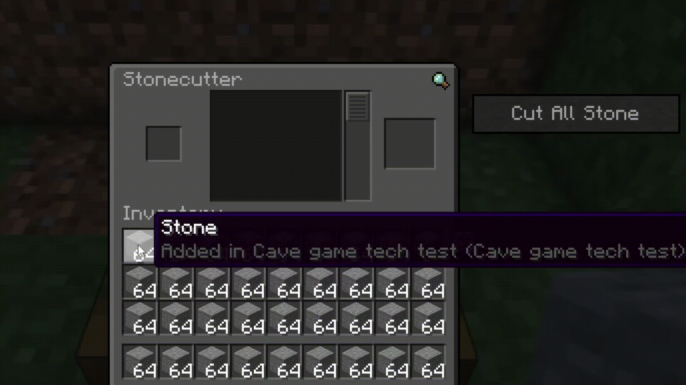

# Fast Stone Cutter

A Minecraft Java Edition 26.2 Fabric client mod that adds a professional `Cut All Stone` button to the vanilla stonecutter screen.



## Behavior

1. Put a stonecutter-compatible material into the stonecutter input slot.
2. Select the desired output recipe in the vanilla recipe list.
3. Press `Cut All Stone`.

The mod sends normal vanilla stonecutter button and slot-click actions to convert all matching source stacks from your inventory into the selected output. It does not send custom packets or bypass server-side validation.

## Build

Minecraft 26.2 requires Java 25 for the Gradle JVM.

```powershell
.\gradlew.bat build
```

## Release

Releases are published to Modrinth via the [Minotaur](https://modrinth.com/plugin/minotaur) Gradle plugin, triggered by pushing a branch-prefixed tag.

1. Bump `mod_version` in `gradle.properties`.
2. Add a new `## X.Y.Z` section to the top of `CHANGELOG.md` describing the changes.
3. Commit both changes on this branch.
4. Tag using `1.21.1-11-v<mod_version>` and push the tag:

```sh
git tag 1.21.1-11-vX.Y.Z && git push origin 1.21.1-11-vX.Y.Z
```
